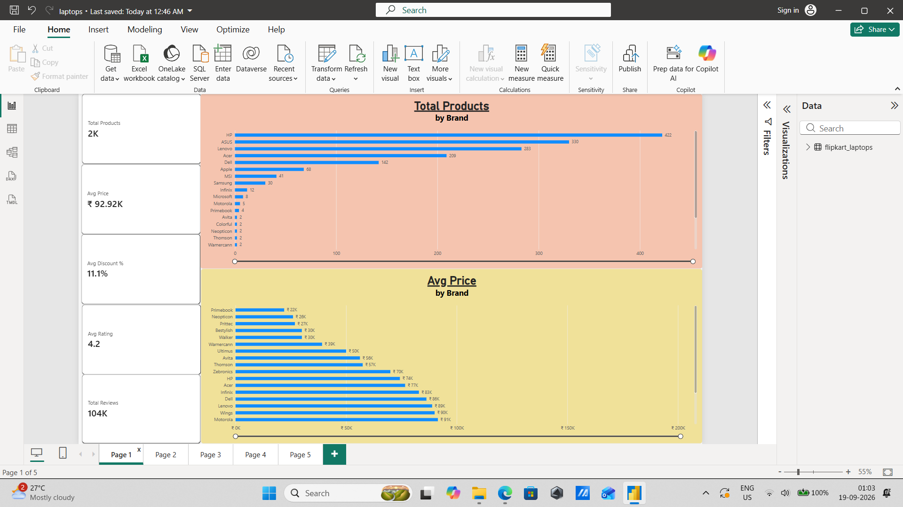
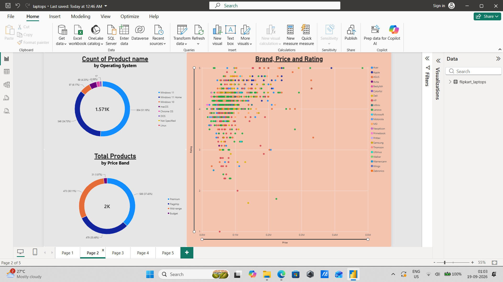
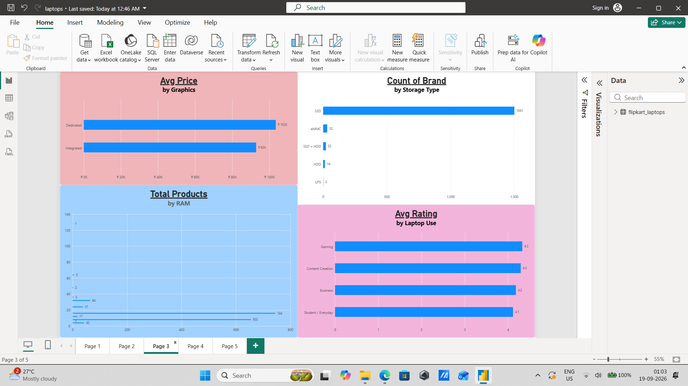
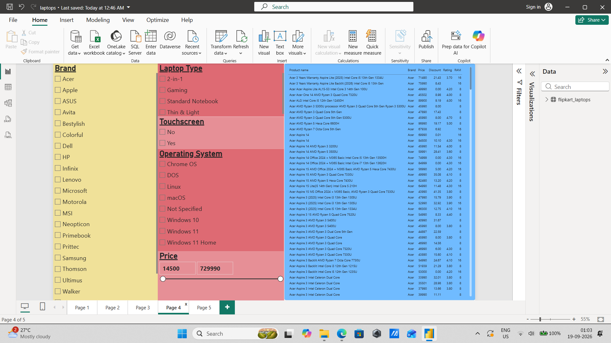

💻 Flipkart Laptop Analysis

An end-to-end data analytics project that collects, cleans, analyzes, and visualizes laptop product data using Python, Pandas, and Power BI.

📌 Project Overview

This project analyzes laptop listings to understand pricing, specifications, ratings, reviews, availability, and other product characteristics.

The workflow covers the complete analytics process:

Data Collection → Data Cleaning → Data Transformation → Exploratory Analysis → Power BI Dashboard → Business Insights

🛠️ Tools & Technologies

- Python
- Pandas
- Regular Expressions (Regex)
- Jupyter Notebook / VS Code
- Power BI
- Git & GitHub
- CSV

📊 Dashboard Features

The Power BI dashboard provides an interactive view of the laptop market, including:

- Total number of laptops
- Laptop price analysis
- Discount analysis
- Brand-wise comparison
- Ratings and review analysis
- RAM and storage analysis
- Processor and operating system analysis
- Touchscreen availability
- Laptop availability
- Interactive slicers and filters
- KPI cards and visual analytics

🐍 Data Processing

Python was used to clean and transform the raw laptop data.

Key data-processing steps included:

- Cleaning product information
- Extracting laptop names from product descriptions
- Extracting ratings and review counts
- Standardizing laptop specifications
- Handling missing and unavailable values
- Creating additional analytical columns
- Preparing the final dataset for Power BI

📁 Project Structure

Flipkart-Laptop-Analysis/
│
├── code/
│   └── laptop_scrape.py
│
├── data/
│   └── laptops_combined.csv
│
├── images/
│   └── dashboard.png
│
├── powerbi/
│   └── Flipkart_Laptop_Analysis.pbix
│
└── README.md

📈 Key Analysis Areas

The project explores relationships between:

- Price and laptop specifications
- Brand and pricing
- Ratings and product popularity
- Discounts and prices
- RAM and storage configurations
- Processor types
- Touchscreen availability
- Product availability

## 🖼️ Dashboard Preview

### Dashboard View 1

### Dashboard View 2

### Dashboard View 3

### Dashboard View 4

🎯 Project Objective

The objective of this project is to demonstrate an end-to-end Data Analytics workflow, from collecting and cleaning raw product data to building an interactive business intelligence dashboard.

🚀 Skills Demonstrated

Python • Data Cleaning • Data Transformation • Pandas • Regex • Exploratory Data Analysis • Power BI • Data Visualization • Dashboard Development • Git • GitHub